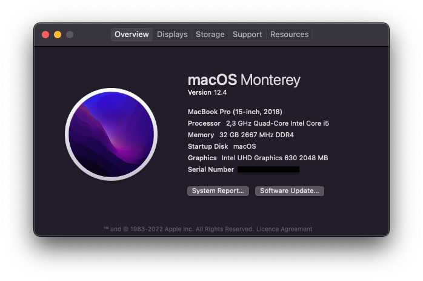

# Dell XPS 15 9570 Monterey
A collection of all resources needed to run macOS Monterey on a Dell XPS 15 9570

> To use iMessage and other Apple services, you need to generate your own serial numbers.

## 💻 Hardware
| Model | XPS15-9570 |
| :- | :- |
| Processor | Intel Core i5-8300H | 
| Memory | Vengeance® Series 32GB (2x16GB) DDR4 |
| Display | 1080p |
| Storage | Samsung SSD 970 EVO Plus 500GB |
| WiFi / Bluetooth | BCM94360NG |

## ⚙️ Software
| Boot loader | OpenCore v0.7.6 |
| :- | :- |
| BIOS | 1.21 |
| CFG Lock | Unlocked |

## 💊 Kexts
| Name | Version |
| :- | :- |
| Lilu | 1.5.8 |
| VirtualSMC | 1.2.8 |
| CPUFriend | 1.2.4 |
| AppleALC | 1.6.7 |
| VoodooI2C | 2.6.5 |
| VoodooPS2Controller | 2.2.7 |
| WhateverGreen | 1.5.5 |
| BrightnessKeys | 1.0.2 |
| NVMeFix | 1.0.9 |
| Sinetek-rtsx | 2.3 |
| USBPorts | ? |
| VerbStub | 1.0.3 |

## 🗄 Sources
- https://github.com/jaromeyer/XPS9570-Catalina
- https://dortania.github.io/OpenCore-Post-Install/misc/msr-lock.html
